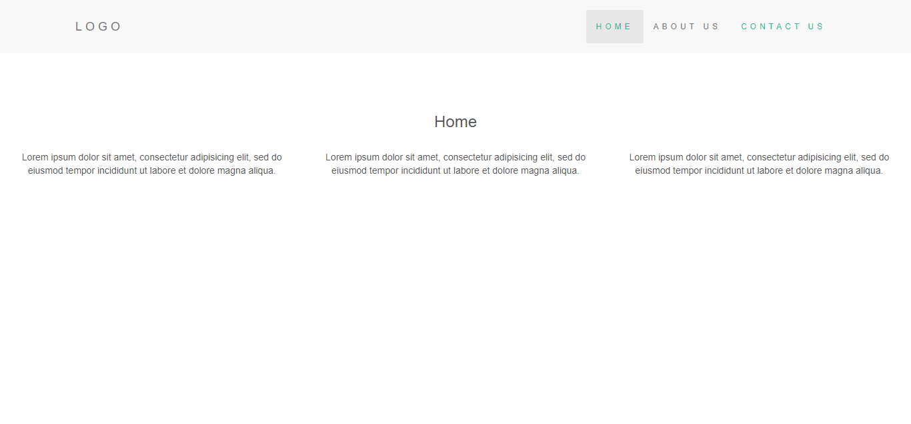

<!--
 * @Date         : 2023-08-09 14:44:21
 * @Author       : BDFD,bdfd2005@gmail.com
 * @Github       : https://github.com/bdfd
 * @LastEditTime : 2023-08-09 14:57:16
 * @LastEditors  : BDFD
 * @Description  :
 * @FilePath     : \README.md
 * Copyright (c) 2023 by BDFD, All Rights Reserved.
-->

# SP055 - BYM - Beside You Mandrain 

<!--  -->

    

## About This Portfolio/Project Details

About This project and the reference link in this repo are for anyone who is interested in working to enter developer world to produce high quality, working style! Check out follow reference link if you think it is interested.

**Project Link:** [BYM - Beside You Mandrain](http://www.google.com/)

## Project Details

The Project Page enlisted as follows:

- [x] **P1-** Index Page
- [x] **P2-** Key Course
- [x] **P3-** Why Learn With Us

## Project Description:

 
Description: Startup Education Porfolio Website.

## Tools Used In This Project

**Tools:** GitHub, Virtual Machine,

**Libraries:** Node.js, Express, HTML, CSS, and JavaScript

**Projects:** BYM - Beside You Mandrain

**Reference:**  
Demo: <a href="http://www.google.com/">Demo Website Link</a>  
Reference:

- <a href="https://drive.google.com/drive/folders/1F2p4Ec1JqMZiyrkjzS_BzTnBXt2AspVE">Orginal Backup File Resource</a>
   

# Build Simple Website with NodeJS, Express & EJS view engine

## Document

- Install dependencies using [npm](https://www.npmjs.com/) javascript package manager: `yarn`
- Start node server with [nodemon](https://nodemon.io/): `yarn start`
- Tune to url: `http://localhost:22513`

All boilerplate code managed by [express generator](https://expressjs.com/en/starter/generator.html) framework adhering to DRY rule. Routes are defined in routes/index.js file, static view pages are in views folder. I have implemented partials concept to avoid code redundancy in html using EJS view engine. Css and Javascript files are stored in public folder.

## Screenshot

### Thanks For Vist This Repositories! Please Star If You Like It

### <i>KEEP AWESOME & STAY COOL!</i>

### Feel Free To Fork And Report If You Find Any Issue :)

